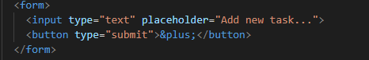

#  To-Do List App using HTML, CSS and Javascript

This application is a basic to-do list app in Javascript which wil allow the user to add new tasks, delete tasks, mark task as completed, edit task, sort tasks by date, and search tasks.

A beginner level project created to learn and practice basic methods the webpage on the user's action and make it interactive. 

## Final Project Visual

## How to Use the Project 

### Step 1: Basic Structure of the Project
Container for the app. Elements must be put inside the container which will then be the parent of the app.

### Step 2: Creating Forms
Create a form with a text input and a submit button.

### Step 3: Create a list of tasks  using an <ul> and element inside with class 'app'.
This will not be inserted in HTML.

### Step 4: CSS and the use of flexbox

### Step 5:Inserting Media Queries

### Step 6:Fonts
I imported a google font as shown below

### Step 7: Javascript
Tasks are loaded from local storage 

App will work in the following steps:
*Load tasks
*Add tasks
*Edit tasks
*Mark complete
*Remove tasks
